# 介绍 

# 国际支付系统、跨境支付系统、独立站首选、信用卡支付首选、可接入现成渠道

国际支付系统是一个聚合平台，支持多渠道收款(stripe,ipay88,paygate,kesspay,ipaytok,coolcash等)，每个渠道单独封装了一套标准restfull API,可以作为支付平台对外服务，也可以自己使用。有完善的管理后台以及商户后台，java版、php版对接demo都有，基于wordpress的支付插件也有。功能非常齐全，适合国际支付快速创业或自用收单，开箱即用。如有其他渠道需要对接或是封装支付插件，需要接入国际支付渠道的，独立站搭建的，都可联系，快速响应。

# 软件架构
软件架构说明 后台是 java，基于springboot构建， 数据库是 mysql 前端是 ‌Thymeleaf 单体架构，配合ng等可以集群部署

 

加V 可以提供的服务

1、需要这套系统迅速开展自己跨境业务的（包教包会）

2、任何支付渠道的对接服务

3、wordpress 支付插件封装、渠道对接

4、独立站搭建（wordpress源码交付）

5、国际支付渠道开通、接入

6、其他各种外贸、跨境、技术问题

扯淡的、吹牛逼的 非诚勿扰！！！

# 管理后台
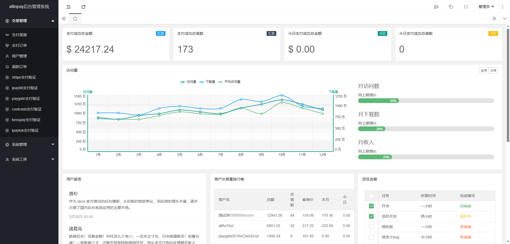
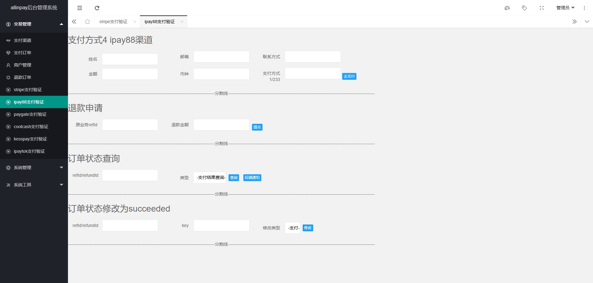
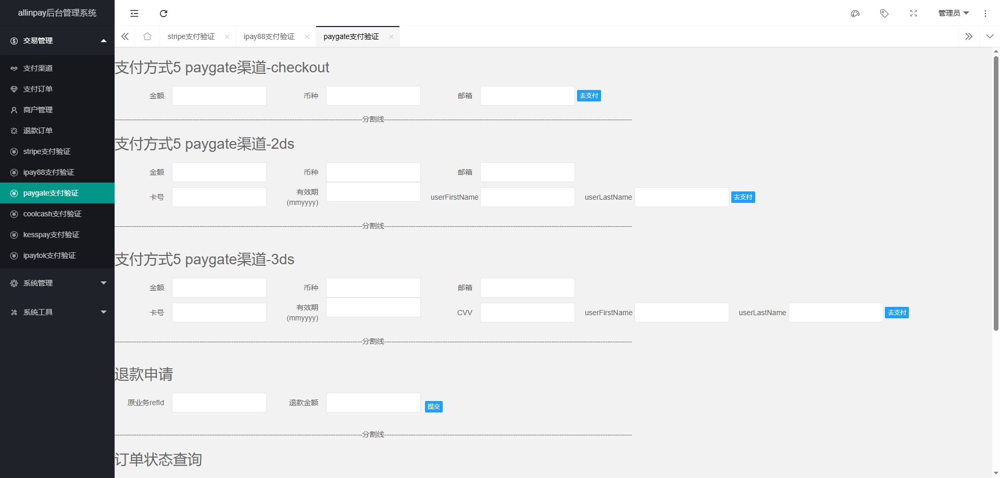
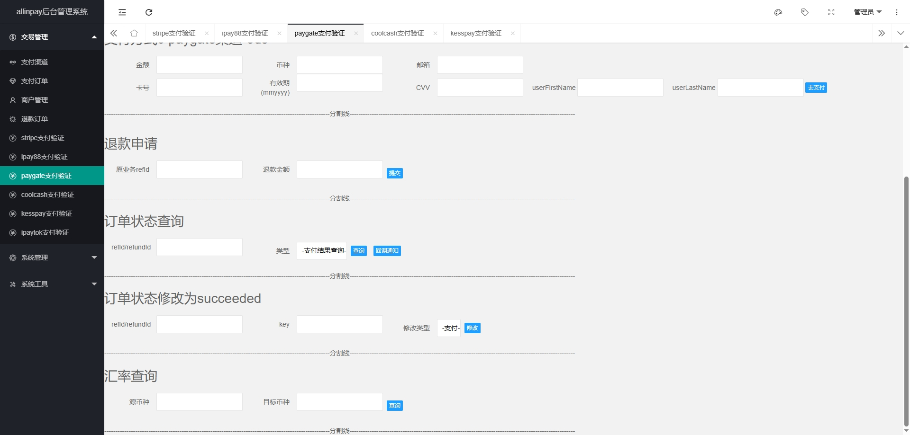

# 代码
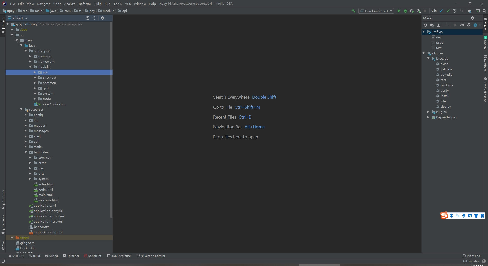

# 对接demo
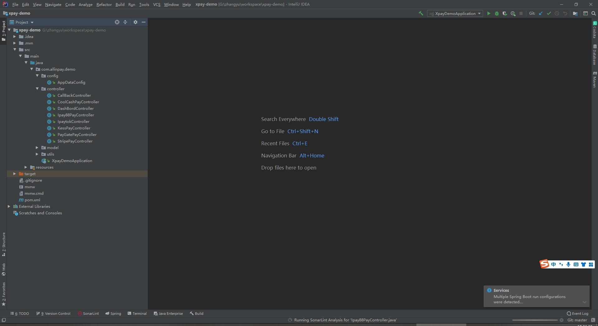

# php插件
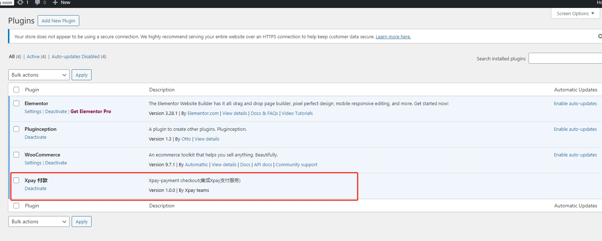
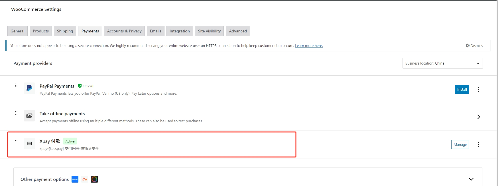

# 数据库
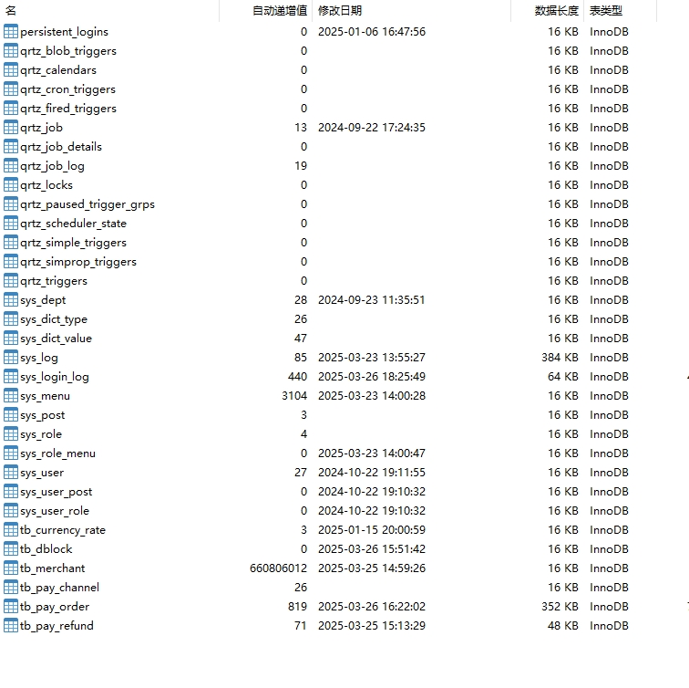

# 对外api
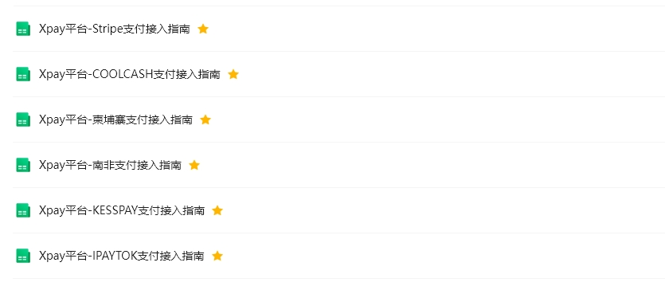
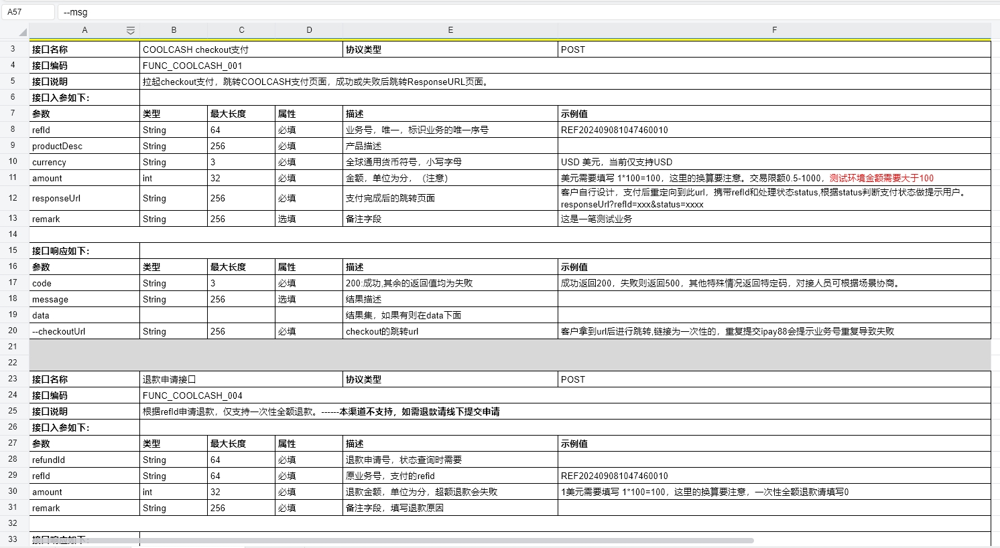

